# 模块流程图与职责说明

---

## 一、整体模块依赖关系

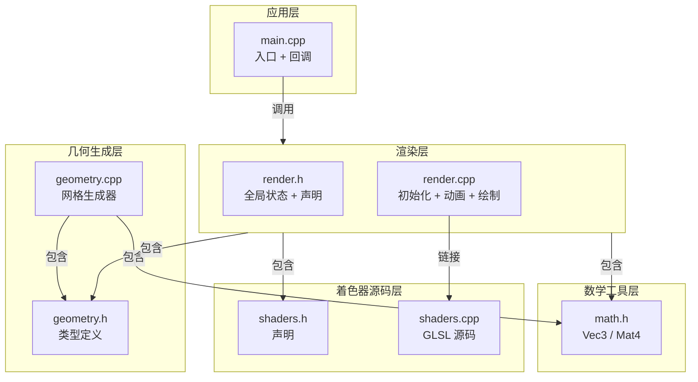

---

## 二、主流程调用链

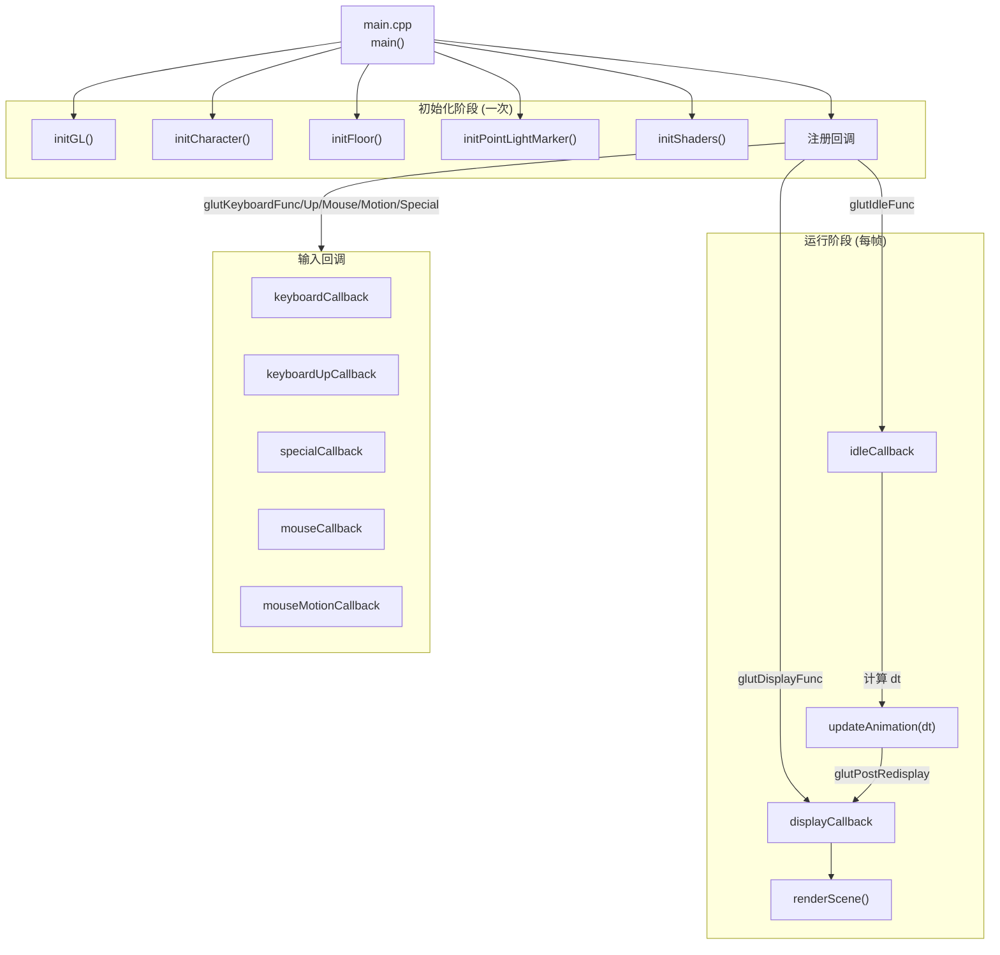

---

## 三、模块详细说明

### 3.1 应用入口 — `src/main.cpp`

| 项目 | 内容 |
|------|------|
| **作用** | 窗口创建、OpenGL 上下文初始化、FreeGLUT 回调注册、主循环启动 |
| **关键函数** | `main()` |
| **职责** | 1. `glutInit` 设置 OpenGL 4.1 Core Profile 2. `glewInit` 初始化扩展，检查曲面细分支持 3. 按序调用 5 个初始化函数 4. 注册 8 个 FreeGLUT 回调 5. 启动 `glutMainLoop` 6. 退出时清理 GL 资源 |

### 3.2 公共宏 — `src/common.h`

| 项目 | 内容 |
|------|------|
| **作用** | 跨平台 GLUT/GLEW 头文件包含、窗口默认值定义 |
| **关键定义** | 平台宏 `__APPLE__` / `USE_GLEW` / `USE_FREEGLUT` |
| **职责** | 1. macOS 与 Linux 的 GLUT/GLEW 引入顺序处理 2. 窗口宽高默认值、应用名、版本号 |

---

### 3.3 数学工具 — `src/math/math.h`

| 项目 | 内容 |
|------|------|
| **作用** | 手写 3D 数学库，提供 Vec3 和 Mat4 |
| **关键类型** | `struct Vec3`, `struct Mat4` |
| **关键方法** | 见下表 |

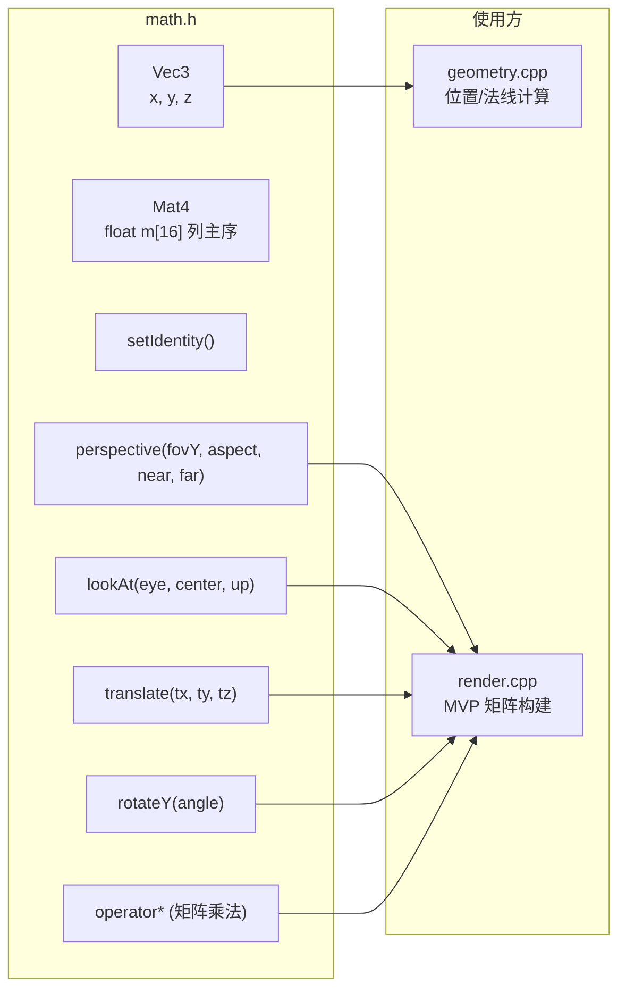

---

### 3.4 几何生成 — `src/geometry/`

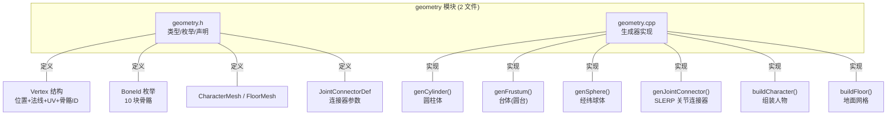

| 文件 | 函数 | 作用 |
|------|------|------|
| `geometry.h` | — | 定义 `Vertex`、`BoneId` 枚举（10 骨）、`CharacterMesh`、`JointConnectorDef`、函数声明 |
| `geometry.cpp` | `genCylinder()` | 生成固定半径圆柱体网格（6 边 × 2 环），法线水平径向 |
| | `genFrustum()` | 生成半径线性变化的台体（圆台） |
| | `genSphere()` | 生成经纬球体，法线精确球面径向 |
| | `genJointConnector()` | SLERP 球面插值生成关节过渡网格 |
| | `buildCharacter()` | 按躯干→头→四肢→关节顺序组装完整人物 |
| | `buildFloor()` | 生成 20×20 方格地面 |

#### 关节连接器定义表 (`geometry.cpp`)

| 连接器 | 起点 (父骨骼末端) | 终点 (关节中心) | 半径 | 归属 |
|--------|------------------|----------------|------|------|
| 左肩 | `(-0.20, 0.90)` | `(-0.26, 0.90)` | 0.055→0.055 | TORSO(0) |
| 右肩 | `( 0.20, 0.90)` | `( 0.26, 0.90)` | 0.055→0.055 | TORSO(0) |
| 左肘 | `(-0.26, 0.52)` | `(-0.28, 0.48)` | 0.055→0.045 | L_UPPER_ARM(2) |
| 右肘 | `( 0.26, 0.52)` | `( 0.28, 0.48)` | 0.055→0.045 | R_UPPER_ARM(4) |
| 左髋 | `(-0.10, 0.15)` | `(-0.10, 0.10)` | 0.085→0.12 | TORSO(0) |
| 右髋 | `( 0.10, 0.15)` | `( 0.10, 0.10)` | 0.085→0.12 | TORSO(0) |
| 左膝 | `(-0.10,-0.35)` | `(-0.11,-0.40)` | 0.085→0.065 | L_UPPER_LEG(6) |
| 右膝 | `( 0.10,-0.35)` | `( 0.11,-0.40)` | 0.085→0.065 | R_UPPER_LEG(8) |

---

### 3.5 着色器源码 — `src/shaders/`

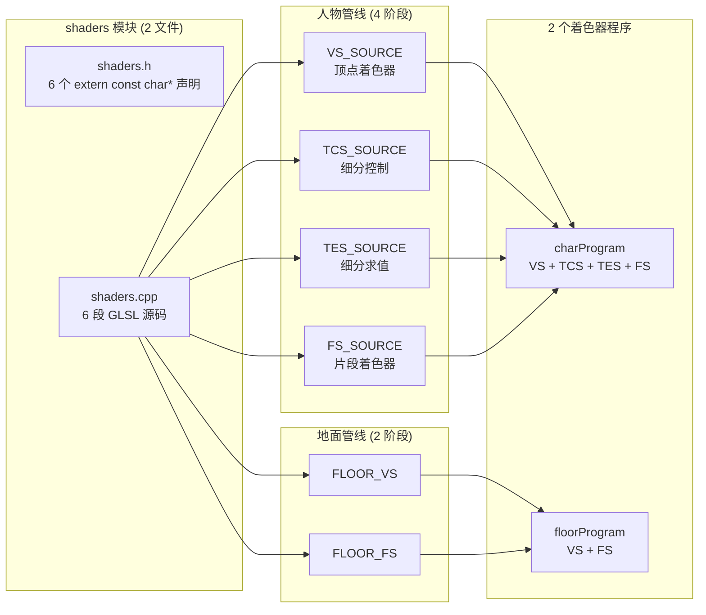

| 文件 | 符号 | 阶段 | 作用 |
|------|------|------|------|
| `shaders.h` | 声明 | — | 6 个 `extern const char*` 全局字符串声明 |
| `shaders.cpp` | `VS_SOURCE` | Vertex | 骨骼关节旋转 + 3 层动画混合 + antiClip 防穿插 |
| | `TCS_SOURCE` | Tess Control | PN 三角形 10 个贝塞尔控制点计算 + 细分级别 |
| | `TES_SOURCE` | Tess Eval | 贝塞尔三角曲面重心坐标求值 + 法线插值 |
| | `FS_SOURCE` | Fragment | Gooch 暖冷色 + Blinn-Phong 高光 + Fresnel + Rim + 骨骼颜色 + Gamma |
| | `FLOOR_VS` | Vertex | 地面简单顶点变换 |
| | `FLOOR_FS` | Fragment | 地面棋盘格颜色 + 深度雾 |

#### 顶点着色器（VS）内部骨骼分组逻辑

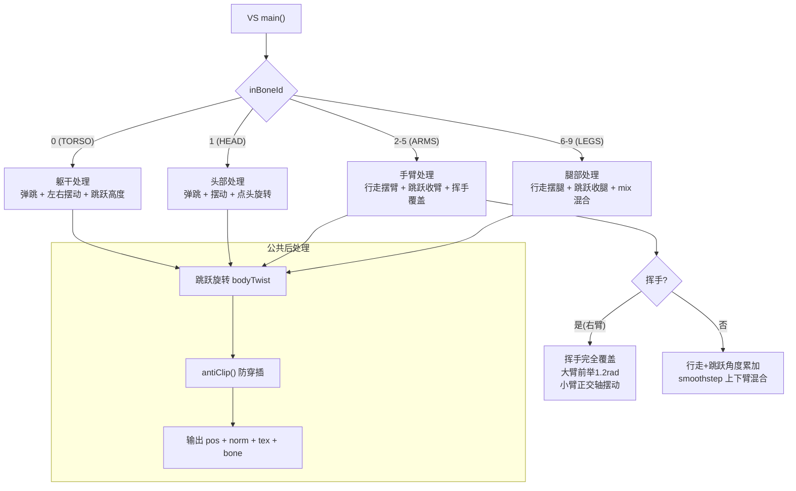

#### 片段着色器（FS）光照计算流程

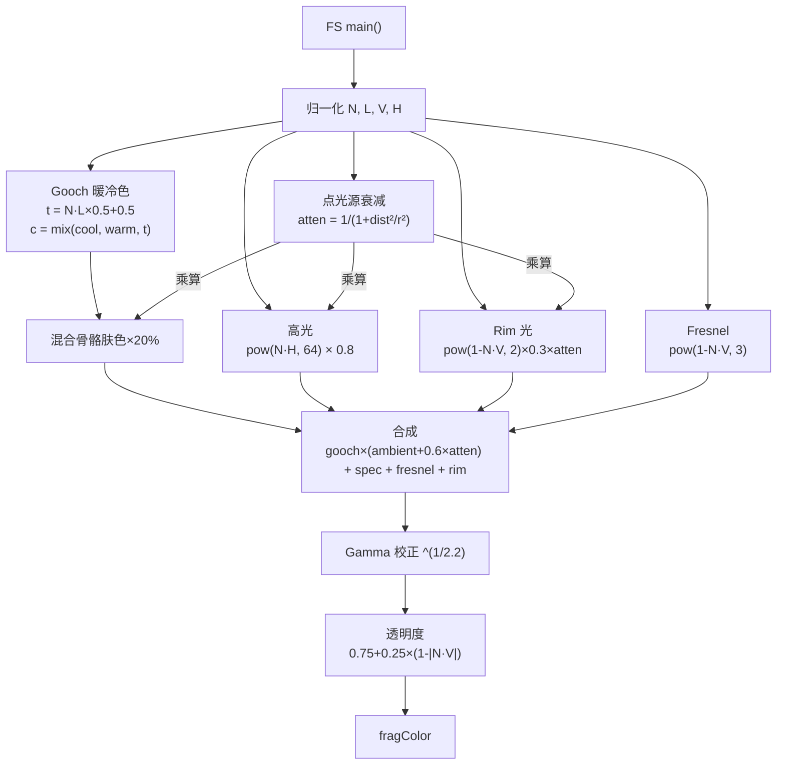

---

### 3.6 渲染层 — `src/render/`

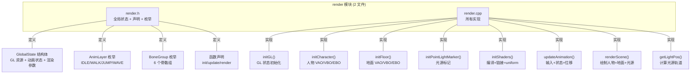

| 文件 | 函数 / 类型 | 作用 |
|------|-------------|------|
| `render.h` | `GlobalState` | **全局单例** — 管理所有 GL 资源句柄、uniform 位置、动画状态、摄像机参数、人物位置 |
| | `enum AnimLayer` | 动画层优先级：IDLE(0) < WALK(1) < JUMP(2) < WAVE(3) |
| | `enum BoneGroup` | 骨骼分组：ROOT/HEAD/LEFT_ARM/RIGHT_ARM/LEFT_LEG/RIGHT_LEG |
| `render.cpp` | `GlobalState g;` | 全局状态实例 |
| | `compileShader()` | 编译单个 GLSL 着色器，输出错误日志 |
| | `linkProgram()` | 链接多个着色器为程序 |
| | `initGL()` | 设置深度测试 `LEQUAL`、面剔除 `CCW`、混合 `SRC_ALPHA`、清屏色 |
| | `initCharacter()` | 调用 `buildCharacter()` → 创建 VAO/VBO/EBO → 配置 4 个顶点属性 |
| | `initFloor()` | 调用 `buildFloor()` → VAO/VBO/EBO → 仅位置+UV |
| | `initPointLightMarker()` | 创建光源标记的 VAO/VBO（动态更新位置） |
| | `initShaders()` | 编译 4 阶段着色器 → 链接人物程序 → 编译 2 阶段地面程序 → 获取所有 uniform 位置 |
| | `updateAnimation(dt)` | **核心每帧更新** — 时间推进、跳跃/挥手状态机、WASD 输入处理、人物位移 |
| | `getLightPos()` | 计算随时间运动的点光源轨道位置 |
| | `renderScene()` | **核心每帧绘制** — 构建 MVP 矩阵、上传 uniform、绘制人物(细分)/地面/光源 |

#### GlobalState 全局状态结构

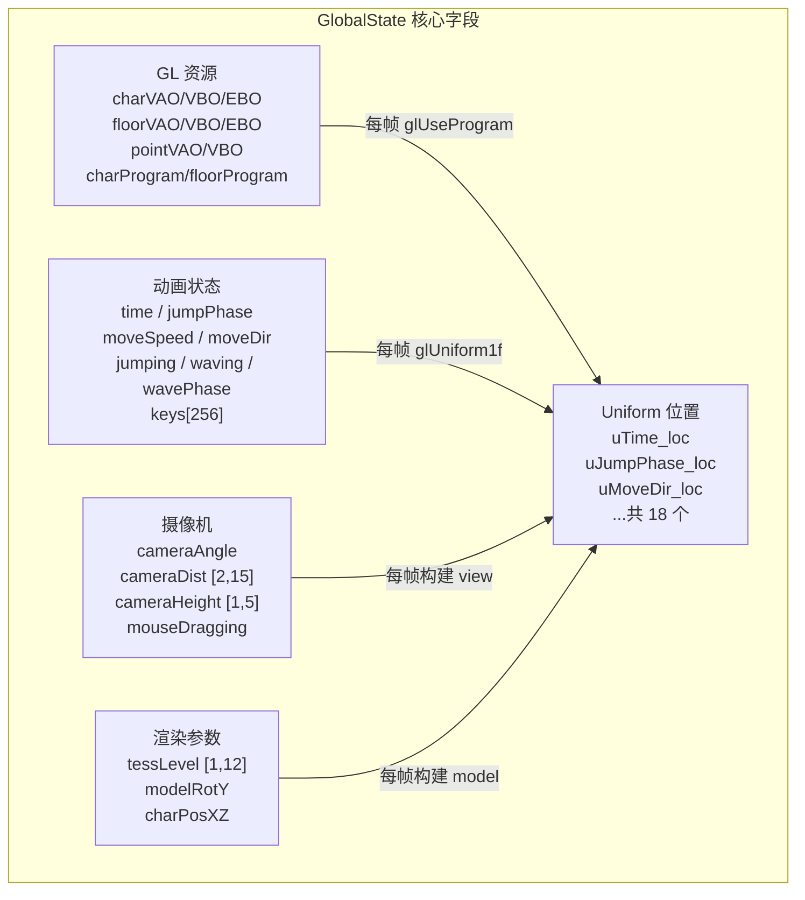

---

## 四、分层调用关系总图

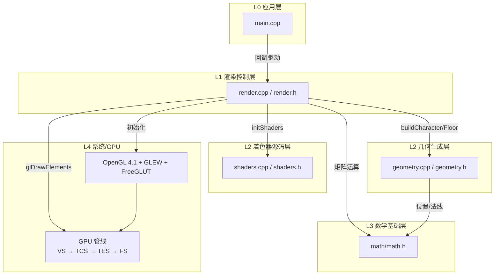

### 函数调用关系矩阵

| 调用者 | 被调用者 | 时机 | 作用 |
|--------|---------|------|------|
| `main()` | `initGL()` | 启动 | 设置 OpenGL 全局状态 |
| `main()` | `initCharacter()` | 启动 | 生成人物网格并上传 GPU |
| `main()` | `initFloor()` | 启动 | 生成地面网格并上传 GPU |
| `main()` | `initPointLightMarker()` | 启动 | 创建光源标记 VAO |
| `main()` | `initShaders()` | 启动 | 编译链接着色器程序 |
| `initCharacter()` | `buildCharacter()` | 启动 | 组装人物各部位网格 |
| `initFloor()` | `buildFloor()` | 启动 | 生成方格地面 |
| `initShaders()` | `compileShader()` ×4 | 启动 | 编译 VS/TCS/TES/FS |
| `initShaders()` | `linkProgram()` | 启动 | 链接成 charProgram |
| `idleCallback()` | `updateAnimation(dt)` | 每帧 | 更新动画状态 + 处理输入 + 移动人物 |
| `displayCallback()` | `renderScene()` | 每帧 | 构建矩阵 + 设置 uniform + 绘制场景 |
| `renderScene()` | `getLightPos()` | 每帧 | 计算光源轨道位置 |
| `keyboardCallback()` | — | 按键时 | 跳跃/挥手/光源/细分/摄像机控制 |
| `mouseCallback()` | — | 点击时 | 左键拖拽 / 滚轮缩放 |
| `mouseMotionCallback()` | — | 拖拽时 | 旋转 / 升降摄像机 |

---

## 五、文件与模块对应汇总

| 文件路径 | 模块 | 角色 | 核心数据/函数 |
|---------|------|------|-------------|
| `src/main.cpp` | 应用入口 | 调度器 | `main()`, 8 个 FreeGLUT 回调 |
| `src/common.h` | 跨平台配置 | 配置 | 平台宏、GLUT/GLEW 头文件顺序 |
| `src/math/math.h` | 数学工具 | 基础库 | `Vec3`, `Mat4` (perspective/lookAt/rotateY/translate/operator*) |
| `src/geometry/geometry.h` | 几何类型 | 接口 | `Vertex`, `BoneId`, `CharacterMesh`, `JointConnectorDef` |
| `src/geometry/geometry.cpp` | 几何生成 | 实现 | 5 个生成器 + `buildCharacter` + `buildFloor` |
| `src/shaders/shaders.h` | 着色器声明 | 接口 | 6 个 `extern const char*` |
| `src/shaders/shaders.cpp` | 着色器源码 | 资源 | 6 段 GLSL (VS/TCS/TES/FS/FLOOR_VS/FLOOR_FS) |
| `src/render/render.h` | 渲染声明 | 接口 | `GlobalState`, `AnimLayer`, `BoneGroup`, 函数声明 |
| `src/render/render.cpp` | 渲染实现 | 核心 | `compileShader`/`linkProgram`, 4 个 init, `updateAnimation`, `renderScene` |

---

## 六、数据流走向

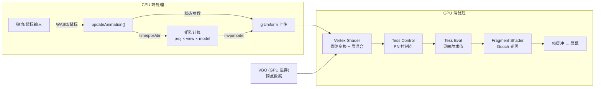

---

## 七、关键流程时序

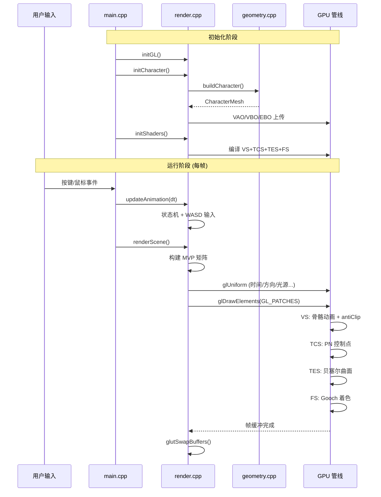