# 关键代码说明与伪代码

---

## 总体架构图

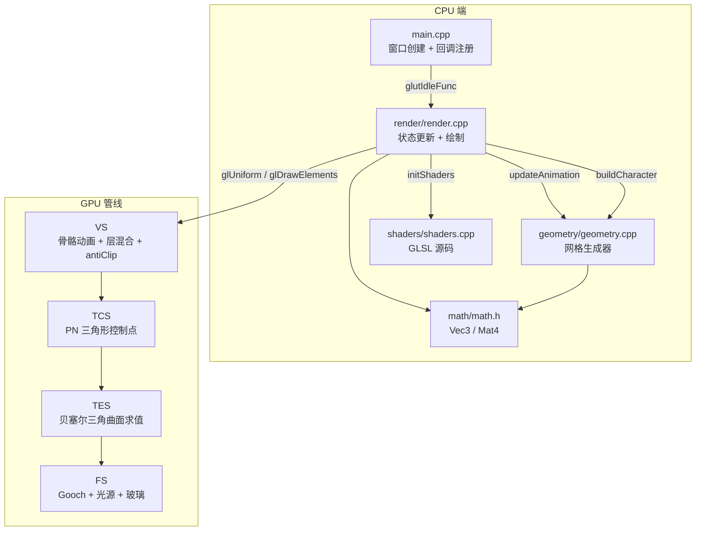

---

## 难点 ①：SLERP 关节连接器

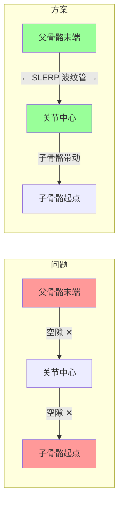

**问题 1**：骨骼动画中，父骨骼末端与子骨骼起点之间存在空隙。关节球虽然能填充，但球体在骨骼旋转时会露出缝隙，且视觉上生硬不自然。

**方案 1**：在父骨骼末端与关节中心之间生成一段「波纹管」式过渡网格（Joint Connector）。所有顶点归属父骨骼，随父骨骼运动而自然覆盖关节空隙。使用 SLERP（Spherical Linear Interpolation）对环形方向和法线做球面插值，确保过渡平滑。

**计算公式 1**：

$$
\begin{aligned}
\mathbf{dir}_0 &= (0, 1, 0) \quad \text{(父骨骼局部 Y 轴)} \\
\mathbf{dir}_1 &= \text{normalize}(\mathbf{jointPos} - \mathbf{parentEnd}) \\
\mathbf{rotAxis} &= \text{normalize}(\mathbf{dir}_0 \times \mathbf{dir}_1) \\
\theta_{total} &= \arccos(\text{clamp}(\mathbf{dir}_0 \cdot \mathbf{dir}_1, -1, 1))
\end{aligned}
$$

环 $t \in [0, 1]$:

$$
\begin{aligned}
\mathbf{center} &= \text{lerp}(\mathbf{parentEnd},\ \mathbf{jointPos},\ t) \\
r &= \text{lerp}(startRadius,\ endRadius,\ t) \\
\theta &= \theta_{total} \cdot t \\
\mathbf{ringDir} &= \mathbf{dir}_0\cos\theta + (\mathbf{rotAxis} \times \mathbf{dir}_0)\sin\theta + \mathbf{rotAxis}(\mathbf{rotAxis} \cdot \mathbf{dir}_0)(1 - \cos\theta) \\
\mathbf{tangent} &= \text{rotate}(\mathbf{tangent}_0,\ \mathbf{rotAxis},\ \theta) \\
\mathbf{bitangent} &= \mathbf{ringDir} \times \mathbf{tangent}
\end{aligned}
$$

顶点 $i$:

$$
\begin{aligned}
\phi &= \frac{i}{sides} \cdot 2\pi \\
\mathbf{position} &= \mathbf{center} + (\mathbf{tangent} \cdot \cos\phi + \mathbf{bitangent} \cdot \sin\phi) \cdot r \\
\mathbf{normal} &= \text{normalize}(\mathbf{tangent} \cdot \cos\phi + \mathbf{bitangent} \cdot \sin\phi)
\end{aligned}
$$

**伪代码 1**：

```
genJointConnector(def, sides, rings, verts, idx)
    // 提取参数
    startPos = def.parentEnd        // 父骨骼末端（连接器起点）
    endPos   = def.joint            // 关节中心（连接器终点）
    startR   = def.startRadius
    endR     = def.endRadius
    
    // 计算连接器轴向
    axisVec = normalize(endPos - startPos)
    if length(endPos - startPos) < 阈值: return  // 退化情况
    
    // SLERP 参数
    dir0 = (0, 1, 0)               // 起始方向：骨骼局部 Y
    dir1 = axisVec                  // 结束方向：指向关节
    rotAxis = normalize(cross(dir0, dir1))
    totalAngle = acos(clamp(dot(dir0, dir1), -1, 1))
    if crossLen < 阈值:
        if dot < 0: totalAngle = π  // 反平行
        rotAxis = (1, 0, 0)
    
    // 初始切线（用于构建环）
    tangent0 = normalize(cross(dir0, (1, 0, 0)))
    if length(tangent0) < 阈值: tangent0 = (0, 0, 1)
    
    for j = 0 to rings:
        t = j / rings
        
        // 线性插值：位置 + 半径
        cx = lerp(startPos.x, endPos.x, t)
        cy = lerp(startPos.y, endPos.y, t)
        cz = lerp(startPos.z, endPos.z, t)
        r  = lerp(startR, endR, t)
        
        // SLERP：绕 rotAxis 旋转 angle 度
        angle = totalAngle × t
        ca = cos(angle), sa = sin(angle), oc = 1 - ca
        rx, ry, rz = rotAxis
        
        // Rodrigues 旋转公式：dir0 绕 rotAxis 转 angle
        ringDir.x = dir0.x·(ca+rx²·oc) + dir0.y·(rx·ry·oc-rz·sa) + dir0.z·(rx·rz·oc+ry·sa)
        ringDir.y = dir0.x·(ry·rx·oc+rz·sa) + dir0.y·(ca+ry²·oc) + dir0.z·(ry·rz·oc-rx·sa)
        ringDir.z = dir0.x·(rz·rx·oc-ry·sa) + dir0.y·(rz·ry·oc+rx·sa) + dir0.z·(ca+rz²·oc)
        
        // 切线同步旋转
        tanRot = rotate(tangent0, rotAxis, angle)  // 同上 Rodrigues
        bitangent = cross(ringDir, tanRot)
        
        for i = 0 to sides:
            θ = i / sides × 2π
            ct = cos(θ), st = sin(θ)
            
            // 环上顶点位置 = 中心 + 径向偏移
            px = cx + (tanRot.x·ct + bitangent.x·st) × r
            py = cy + (tanRot.y·ct + bitangent.y·st) × r
            pz = cz + (tanRot.z·ct + bitangent.z·st) × r
            
            // 法线 = 径向方向（归一化）
            nx = tanRot.x·ct + bitangent.x·st
            ny = tanRot.y·ct + bitangent.y·st
            nz = tanRot.z·ct + bitangent.z·st
            (nx,ny,nz) = normalize(nx,ny,nz)
            
            顶点 = {位置, 法线, UV=(i/sides, t), boneId=父骨}
            添加到 verts
    
    // 三角形带索引
    for j = 0 to rings-1:
        for i = 0 to sides-1:
            idx += [a, c, b, b, c, d]  // 四边形拆两个三角形
```

---

## 难点 ②：动画层系统与状态机

**问题 2**：人物同时可能处于行走、跳跃、挥手等多种动画状态，不同动画对同一骨骼施加不同变换，需要解决优先级和混合问题。

**方案 2**：设计 4 层动画系统（优先级从高到低），每层独立计算骨骼角度，最终按优先级规则混合。

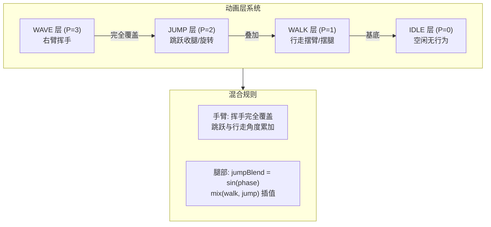

**计算公式 2**：

$$
\begin{aligned}
\text{swingAmp} &= 1.0 \times \text{speedFactor} \\
\text{kneeBend} &= 0.7 \times \text{speedFactor} \\
\text{elbowBend} &= 0.4 \times \text{speedFactor} \\
\text{bodyBob} &= 0.10 \times \text{speedFactor} \\
\text{bodySway} &= 0.05 \times \text{speedFactor} \\
\text{hipTwist} &= 0.12 \times \text{speedFactor}
\end{aligned}
$$

跳跃参数（$uJumpPhase \in [0, 1]$）:

$$
\begin{aligned}
jumpH &= \sin(phase \cdot \pi) \\
jumpTuck &= 0.6 \times \sin(phase) \\
jumpTwist &= 0.3 \times \sin(phase \times 2)
\end{aligned}
$$

混合规则:

$$
\begin{aligned}
\text{手臂:} &\quad \text{挥手完全覆盖跳跃和行走}\\
&\quad \text{跳跃与行走角度累加} \\
\text{腿部:} &\quad jumpBlend = \sin(phase \cdot \pi) \\
&\quad finalAngle = \text{mix}(walkAngle,\ jumpAngle,\ jumpBlend)
\end{aligned}
$$

**伪代码 2**：

```
// === 跳跃状态机 (在 updateAnimation 中) ===
if 按下跳跃键 AND (jumpPhase == 0 OR jumpPhase == 1):
    jumpPhase = 0.001      // 触发起跳
    
if 0 < jumpPhase < 1:
    jumpPhase += dt × 1.8  // 上升阶段
    if jumpPhase >= 1: jumpPhase = 1  // 到达最高点/落地

if 松开跳跃键:
    jumpPhase = 1          // 进入下落阶段


// === 挥手状态机 (在 updateAnimation 中) ===
if waving:
    wavePhase += dt × 3.0  // 挥手相位推进
else:
    wavePhase = 0          // 立即停止


// === 顶点着色器中的层混合 ===
VS_main(inPos, inNormal, inBoneId):
    // 计算各层参数（基于 uTime, uJumpPhase, uWavePhase）
    
    // 行走层
    walkShoulder = swingAmp × sign × sin(t)      // 臂摆动
    walkElbow    = elbowBend × sign × |sin(t)|   // 肘弯曲
    walkHip      = swingAmp × sign × sin(t)       // 腿摆动
    walkKnee     = kneeBend × sign × (sin(t)×0.5+0.5)  // 膝弯曲
    
    // 跳跃层
    jumpShoulder = -jumpTuck × 0.3 × sign
    jumpElbow    = -jumpTuck × 0.4 × sign
    jumpHip      = -jumpTuck × 0.4 × sign
    jumpKnee     = -jumpTuck × 0.5 × sign
    
    // 挥手层（仅右臂）
    if 右臂 AND waving:
        waveShoulder = 1.2            // 大臂前举固定角度
        waveElbow    = 0.8 × sin(t×8) // 小臂左右摆动
        最终角度 = 挥手角度  // 完全覆盖
    else:
        // 优先级：跳跃叠加到行走上
        最终角度 = 行走角度 + 跳跃角度

    // 上臂/前臂（大腿/小腿）分层变换 + smoothstep 混合
    if 骨 == 手臂:
        // 上臂变换：仅肩关节旋转
        posU = shoulder + rotateX(relU, shoulderAngle)
        
        // 前臂变换：肩 + 肘两级旋转
        relF = rotateX(relF, shoulderAngle)
        rotatedElbow = rotateX(elbow - shoulder, shoulderAngle)
        foreRel = relF - rotatedElbow
        foreRel = rotateX(foreRel, elbowAngle)
        posF = shoulder + rotatedElbow + foreRel
        
        // 过渡混合
        blend = smoothstep(kneeY - 0.08, kneeY + 0.08, inPos.y)
        pos = mix(posF, posU, blend)
```

---

## 难点 ③：PN 三角形曲面细分

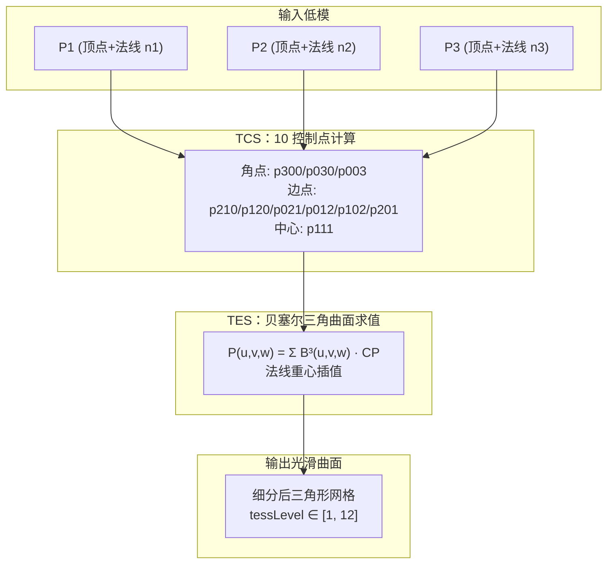

**方案 3**：在 TCS（细分控制着色器）中为每个三角形计算 10 个贝塞尔三角曲面控制点，TES（细分求值着色器）在重心坐标下求值。PN 三角形比普通细分更光滑，因为它在顶点法线方向上偏移边中点，使曲面法向连续。

**计算公式 3**：

输入三角形 $\mathbf{p}_1, \mathbf{p}_2, \mathbf{p}_3$，顶点法线 $\mathbf{n}_1, \mathbf{n}_2, \mathbf{n}_3$

**角点控制点（3 个）**:

$$
\mathbf{p}^{300} = \mathbf{p}_1,\quad \mathbf{p}^{030} = \mathbf{p}_2,\quad \mathbf{p}^{003} = \mathbf{p}_3
$$

**边控制点（6 个）**— 沿法线方向偏移:

$$
\begin{aligned}
w^{12} &= (\mathbf{p}_2 - \mathbf{p}_1) \cdot \mathbf{n}_1 &\quad
\mathbf{p}^{210} &= \frac{2\mathbf{p}_1 + \mathbf{p}_2 - w^{12}\mathbf{n}_1}{3} \\
w^{21} &= (\mathbf{p}_1 - \mathbf{p}_2) \cdot \mathbf{n}_2 &\quad
\mathbf{p}^{120} &= \frac{2\mathbf{p}_2 + \mathbf{p}_1 - w^{21}\mathbf{n}_2}{3} \\
w^{23} &= (\mathbf{p}_3 - \mathbf{p}_2) \cdot \mathbf{n}_2 &\quad
\mathbf{p}^{021} &= \frac{2\mathbf{p}_2 + \mathbf{p}_3 - w^{23}\mathbf{n}_2}{3} \\
w^{32} &= (\mathbf{p}_2 - \mathbf{p}_3) \cdot \mathbf{n}_3 &\quad
\mathbf{p}^{012} &= \frac{2\mathbf{p}_3 + \mathbf{p}_2 - w^{32}\mathbf{n}_3}{3} \\
w^{31} &= (\mathbf{p}_1 - \mathbf{p}_3) \cdot \mathbf{n}_3 &\quad
\mathbf{p}^{102} &= \frac{2\mathbf{p}_3 + \mathbf{p}_1 - w^{31}\mathbf{n}_3}{3} \\
w^{13} &= (\mathbf{p}_3 - \mathbf{p}_1) \cdot \mathbf{n}_1 &\quad
\mathbf{p}^{201} &= \frac{2\mathbf{p}_1 + \mathbf{p}_3 - w^{13}\mathbf{n}_1}{3}
\end{aligned}
$$

**中心控制点（1 个）**:

$$
\begin{aligned}
\mathbf{E} &= \frac{\mathbf{p}^{210} + \mathbf{p}^{120} + \mathbf{p}^{021} + \mathbf{p}^{012} + \mathbf{p}^{102} + \mathbf{p}^{201}}{6} \\
\mathbf{O} &= \frac{\mathbf{p}_1 + \mathbf{p}_2 + \mathbf{p}_3}{3} \\
\mathbf{p}^{111} &= \mathbf{E} + \frac{\mathbf{E} - \mathbf{O}}{2}
\end{aligned}
$$

**贝塞尔三角曲面求值**（$u, v, w$ 重心坐标，$u+v+w=1$）:

$$
\begin{aligned}
\mathbf{P}(u,v,w) &= u^3\mathbf{p}^{300} + v^3\mathbf{p}^{030} + w^3\mathbf{p}^{003} \\
&\quad + 3u^2v\ \mathbf{p}^{210} + 3uv^2\ \mathbf{p}^{120} \\
&\quad + 3v^2w\ \mathbf{p}^{021} + 3vw^2\ \mathbf{p}^{012} \\
&\quad + 3w^2u\ \mathbf{p}^{102} + 3wu^2\ \mathbf{p}^{201} \\
&\quad + 6uvw\ \mathbf{p}^{111}
\end{aligned}
$$

**伪代码 3**：

```
// TCS - 细分控制着色器
TCS_main():
    // 传递原始数据
    tcPos[i] = vPos[i]
    tcNorm[i] = vNorm[i]
    
    if gl_InvocationID == 0:  // 只执行一次
        p1, p2, p3 = 三角形顶点
        n1, n2, n3 = 顶点法线
        
        // 角点
        p300 = p1, p030 = p2, p003 = p3
        
        // 边点：沿法线偏移
        w12 = dot(p2 - p1, n1)   // 边(p1-p2)在n1方向的投影
        p210 = (2·p1 + p2 - w12·n1) / 3
        w21 = dot(p1 - p2, n2)
        p120 = (2·p2 + p1 - w21·n2) / 3
        
        w23 = dot(p3 - p2, n2)
        p021 = (2·p2 + p3 - w23·n2) / 3
        w32 = dot(p2 - p3, n3)
        p012 = (2·p3 + p2 - w32·n3) / 3
        
        w31 = dot(p1 - p3, n3)
        p102 = (2·p3 + p1 - w31·n3) / 3
        w13 = dot(p3 - p1, n1)
        p201 = (2·p1 + p3 - w13·n1) / 3
        
        // 中心点
        E = (p210 + p120 + p021 + p012 + p102 + p201) / 6
        O = (p1 + p2 + p3) / 3
        p111 = E + (E - O) / 2   // 向外膨胀
        
        // 细分级别
        tess = clamp(uTessLevel, 1.0, 12.0)
        gl_TessLevelInner[0] = tess
        gl_TessLevelOuter[0..2] = tess


// TES - 细分求值着色器
TES_main():
    u = gl_TessCoord.x  // 重心坐标
    v = gl_TessCoord.y
    w = gl_TessCoord.z
    
    // 贝塞尔三角曲面求值
    pos = p300·u³ + p030·v³ + p003·w³
        + 3·u²·v·p210 + 3·u·v²·p120
        + 3·v²·w·p021 + 3·v·w²·p012
        + 3·w²·u·p102 + 3·w·u²·p201
        + 6·u·v·w·p111
    
    // 重心插值法线
    norm = normalize(u·n1 + v·n2 + w·n3)
    
    // 变换到世界空间
    fPos = (uModel × vec4(pos, 1)).xyz
    fNorm = normalize(uModel × vec4(norm, 0)).xyz
    
    gl_Position = uMVP × vec4(pos, 1)
```

---

## 难点 ④：摄像机相对移动与朝向同步

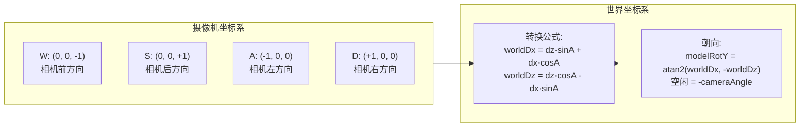

**方案 4**：轨道摄像机模型，将 WASD 局部方向（前/后/左/右）通过摄像机角度转换到世界空间，再计算人物 Y 轴旋转角。

**计算公式 4**：

$$
\begin{aligned}
\text{摄像机模型:}&\quad \mathbf{eye} = (x_c + d\sin\alpha,\ h,\ z_c + d\cos\alpha) \\
&\quad \alpha = 0 \Rightarrow \text{摄像机在 $+Z$（人物后方）}
\end{aligned}
$$

摄像机基向量:

$$
\begin{aligned}
\text{前方向（相机 $\to$ 人物）}&= (-\sin\alpha,\ 0,\ -\cos\alpha) \\
\text{右方向} &= (\cos\alpha,\ 0,\ -\sin\alpha)
\end{aligned}
$$

WASD 到世界坐标:

$$
\begin{aligned}
worldDx &= dz \cdot \sin\alpha + dx \cdot \cos\alpha \\
worldDz &= dz \cdot \cos\alpha - dx \cdot \sin\alpha
\end{aligned}
$$

人物朝向（$\text{rotateY}(\theta)$ 约定: $\text{rotateY}(\theta) \cdot (0,0,-1) = (\sin\theta,0,-\cos\theta)$）:

$$
\theta = \text{atan2}(worldDx,\ -worldDz)
$$

空闲朝向:

$$
modelRotY = -\alpha
$$

**伪代码 4**：

```
updateAnimation(dt):
    // WASD 采集
    dx = 0, dz = 0
    if W: dz -= 1    // 前 (相机朝向)
    if S: dz += 1    // 后
    if A: dx -= 1    // 左
    if D: dx += 1    // 右

    if 有方向输入:
        // 归一化
        len = sqrt(dx² + dz²)
        dx /= len, dz /= len
        
        // 相机角度
        ca = cameraAngle
        cosA = cos(ca), sinA = sin(ca)
        
        // 转换到世界空间
        worldDx = dz·sinA + dx·cosA
        worldDz = dz·cosA - dx·sinA
        
        // 保存移动方向
        moveDirX = worldDx
        moveDirZ = worldDz
        
        // 加速
        moveSpeed += accel × dt
        moveSpeed = min(moveSpeed, 1.2)
        
        // 人物面向运动方向
        modelRotY = atan2(worldDx, -worldDz)
    else:
        // 摩擦减速
        moveSpeed -= friction × dt
        moveSpeed = max(moveSpeed, 0)
        
        // 空闲时面向相机前方
        modelRotY = -cameraAngle
    
    // 应用位移
    charPosX += moveDirX × moveSpeed × dt × 0.8
    charPosZ += moveDirZ × moveSpeed × dt × 0.8
```

---

## 难点 ⑤：骨骼顶点变换与层级混合

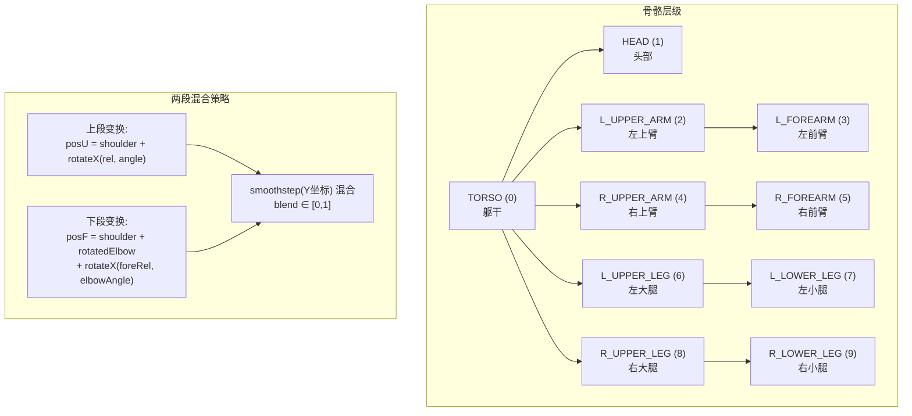

**方案 5**：对每个顶点计算上段和下段两种变换结果，按顶点 Y 坐标相对关节位置的 `smoothstep` 权重混合。同时对上臂/前臂分别应用两级旋转（先肩/髋，后肘/膝）。

**计算公式 5**：

以上臂/前臂为例:

$$
\begin{aligned}
\mathbf{shoulder} &= \text{jointPos}(\text{shoulderBone}) \\
\mathbf{elbow} &= \text{jointPos}(\text{elbowBone})
\end{aligned}
$$

上臂变换:

$$
\begin{aligned}
\mathbf{relU} &= \mathbf{pos} - \mathbf{shoulder} \\
\mathbf{posU} &= \mathbf{shoulder} + \text{rotateX}(\mathbf{relU},\ \theta_{shoulder}) \\
\mathbf{normU} &= \text{rotateX}(\mathbf{norm},\ \theta_{shoulder})
\end{aligned}
$$

前臂变换（两阶段）:

$$
\begin{aligned}
\mathbf{relF} &= \mathbf{pos} - \mathbf{shoulder} \\
\mathbf{relF} &= \text{rotateX}(\mathbf{relF},\ \theta_{shoulder}) \quad \text{(① 先跟肩转)} \\
\mathbf{rotatedElbow} &= \text{rotateX}(\mathbf{elbow} - \mathbf{shoulder},\ \theta_{shoulder}) \\
\mathbf{foreRel} &= \mathbf{relF} - \mathbf{rotatedElbow} \\
\mathbf{foreRel} &= \text{rotateX}(\mathbf{foreRel},\ \theta_{elbow}) \quad \text{(② 肘关节再转)} \\
\mathbf{posF} &= \mathbf{shoulder} + \mathbf{rotatedElbow} + \mathbf{foreRel}
\end{aligned}
$$

混合:

$$
\begin{aligned}
\text{blend} &= \text{smoothstep}(elbowY - 0.08,\ elbowY + 0.08,\ inPos.y) \\
\mathbf{pos} &= \text{mix}(\mathbf{posF},\ \mathbf{posU},\ blend)
\end{aligned}
$$

**伪代码 5**：

```
// 骨骼链接结构
// 左臂: TORSO(0) → L_UPPER_ARM(2) → L_FOREARM(3)
// 右臂: TORSO(0) → R_UPPER_ARM(4) → R_FOREARM(5)
// 左腿: TORSO(0) → L_UPPER_LEG(6) → L_LOWER_LEG(7)
// 右腿: TORSO(0) → R_UPPER_LEG(8) → R_LOWER_LEG(9)

// 关节位置定义 (jointPos)
bone 0: (0.00, 0.00, 0)   // 躯干根
bone 1: (0.00, 1.05, 0)   // 头
bone 2: (-0.26, 0.90, 0)  // 左肩
bone 3: (-0.28, 0.48, 0)  // 左肘
bone 4: ( 0.26, 0.90, 0)  // 右肩
bone 5: ( 0.28, 0.48, 0)  // 右肘
bone 6: (-0.10, 0.10, 0)  // 左髋
bone 7: (-0.11,-0.40, 0)  // 左膝
bone 8: ( 0.10, 0.10, 0)  // 右髋
bone 9: ( 0.11,-0.40, 0)  // 右膝

VS_main:
    // 手臂处理
    if bone ∈ [L_UPPER_ARM, L_FOREARM, R_UPPER_ARM, R_FOREARM]:
        isLeft = (bone是左臂)
        sign = isLeft ? 1 : -1
        shoulderBone = isLeft ? 2 : 4
        elbowBone    = isLeft ? 3 : 5
        
        // 计算最终角度（层混合）
        shoulderAngle = walkShoulder + jumpShoulder
        elbowAngle    = walkElbow + jumpElbow
        if 右臂 AND waving:
            shoulderAngle = waveShoulder // 完全覆盖
            elbowAngle = waveElbow
        
        // 上臂变换
        shoulder = jointPos(shoulderBone)
        relU = pos - shoulder
        posU = shoulder + rotateX(relU, shoulderAngle)
        normU = rotateX(norm, shoulderAngle)
        
        // 前臂变换
        relF = pos - shoulder
        relF = rotateX(relF, shoulderAngle)
        rotatedElbow = rotateX(elbow - shoulder, shoulderAngle)
        foreRel = relF - rotatedElbow
        
        if 挥手状态 AND 右臂:
            // 正交轴旋转（挥手左右摆）
            waveDir = (sin(cameraAngle)×0.5, cos(shoulderAngle), cos(cameraAngle)×0.5)
            waveAxis = normalize(cross(waveDir, (0,1,0)))
            foreRel = rotateAroundAxis(foreRel, waveAxis, elbowAngle)
        else:
            foreRel = rotateX(foreRel, elbowAngle)
        
        posF = shoulder + rotatedElbow + foreRel
        
        // smoothstep 混合
        elbowY = 0.48  // 肘关节Y坐标
        blend = smoothstep(elbowY - 0.08, elbowY + 0.08, inPos.y)
        pos = mix(posF, posU, blend)
        
        // 叠加身体弹跳
        pos.y += bodyBob·sin(t) + jumpH
        pos.x += bodySway·cos(t)

    // 腿部处理（与手臂同理）
    if bone ∈ [L_UPPER_LEG, L_LOWER_LEG, R_UPPER_LEG, R_LOWER_LEG]:
        髋关节旋转 → 膝关节旋转 → smoothstep 混合 → 弹跳叠加
```

---

## 难点 ⑥：防穿插系统（antiClip）

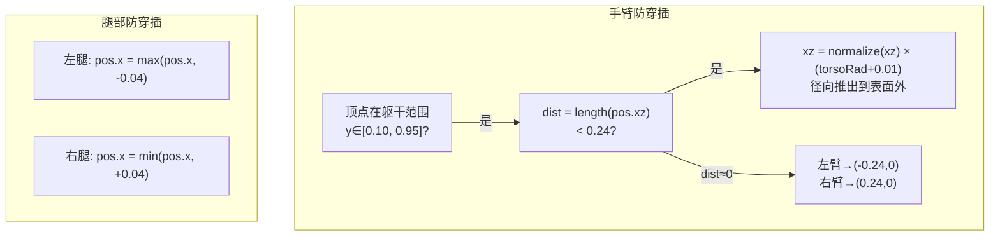

**方案 6**：在顶点着色器中添加 `antiClip()` 函数，检测手臂顶点是否进入躯干圆柱范围，若是则沿径向推离到躯干表面外侧。同时约束左右腿 X 坐标不越过身体中线。

**计算公式 6**：

$$
\begin{aligned}
\text{躯干范围:}&\quad y \in [0.10, 0.95],\quad r_{torso} = 0.23 \\
\end{aligned}
$$

手臂防穿插:

$$
\begin{aligned}
\mathbf{dist} &= \|\text{pos}_{xz}\| \\
\text{若 } dist < r_{torso} + 0.01 &: \\
&\quad \text{if } dist < 0.001:\ \text{pos}_{xz} = \text{sign} \cdot (r_{torso} + 0.01,\ 0) \\
&\quad \text{else}:\ \text{pos}_{xz} = \frac{\text{pos}_{xz}}{\|\text{pos}_{xz}\|} \cdot (r_{torso} + 0.01)
\end{aligned}
$$

腿部防穿插:

$$
\begin{aligned}
\text{左腿:}&\quad \text{pos}.x = \max(\text{pos}.x,\ -0.04) \\
\text{右腿:}&\quad \text{pos}.x = \min(\text{pos}.x,\ +0.04)
\end{aligned}
$$

**伪代码 6**：

```
antiClip(pos, bone):
    if bone ∈ [2,3,4,5]:  // 手臂
        if pos.y ∈ [0.10, 0.95]:  // 在躯干高度范围内
            dist = length(pos.xz)
            if dist < torsoRad + 0.01:
                if dist < 0.001:
                    // 完全在轴上：按左右臂分到两侧
                    if 左臂: pos.xz = (-torsoRad-0.01, 0)
                    if 右臂: pos.xz = ( torsoRad+0.01, 0)
                else:
                    // 径向推出
                    pos.xz = normalize(pos.xz) × (torsoRad + 0.01)
    
    if bone ∈ [6,7]:  // 左腿
        pos.x = max(pos.x, -0.04)  // 不允许越过中线
    
    if bone ∈ [8,9]:  // 右腿
        pos.x = min(pos.x,  0.04)  // 不允许越过中线
    
    return pos
```

---

## 难点 ⑦：Gooch 光照 + 玻璃质感 + 多颜色混合片段着色器

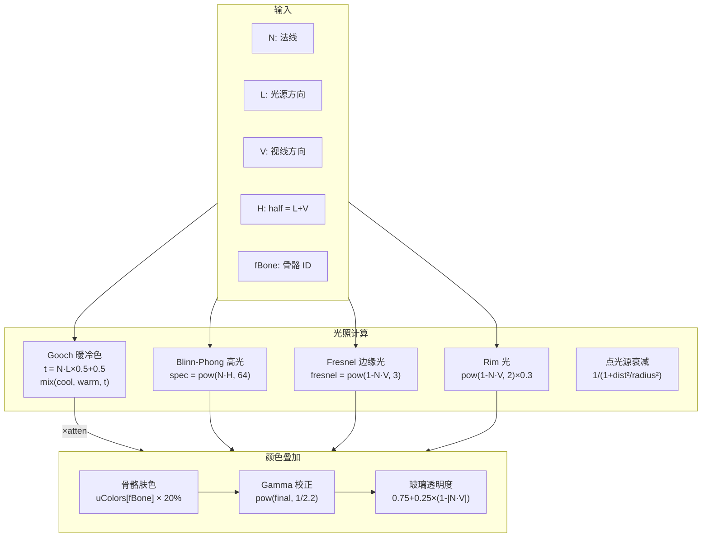

**方案 7**：混合 Gooch 暖冷色着色 + Blinn-Phong 高光 + Fresnel 边缘光 + Rim 光 + 骨骼颜色覆盖，通过 Alpha 值模拟玻璃半透明感。

**计算公式 7**：

Gooch 着色:

$$
\begin{aligned}
t &= \frac{\mathbf{N} \cdot \mathbf{L}}{2} + 0.5,\quad t \in [0,1] \\
\mathbf{c}_{gooch} &= \text{mix}(\mathbf{c}_{cool},\ \mathbf{c}_{warm},\ t)
\end{aligned}
$$

点光源衰减:

$$
\text{atten} = \frac{1}{1 + \|\mathbf{L}_{orig}\|^2 / r^2}
$$

Blinn-Phong 高光:

$$
\begin{aligned}
\mathbf{H} &= \text{normalize}(\mathbf{L} + \mathbf{V}) \\
\text{spec} &= \max(\mathbf{N} \cdot \mathbf{H},\ 0)^{64}
\end{aligned}
$$

Fresnel（边缘光 + 透明度）:

$$
\begin{aligned}
\text{fresnel} &= (1 - \max(\mathbf{N} \cdot \mathbf{V},\ 0))^3 \\
\alpha &= 0.75 + 0.25 \times (1 - |\mathbf{N} \cdot \mathbf{V}|)
\end{aligned}
$$

Rim 光:

$$
\text{rim} = (1 - \max(\mathbf{N} \cdot \mathbf{V},\ 0))^2 \times 0.3 \times \text{atten}
$$

最终合成及 Gamma 校正:

$$
\begin{aligned}
\mathbf{c}_{final} &= \mathbf{c}_{gooch} \cdot (\mathbf{c}_{ambient} + 0.6 \times \text{atten}) + \text{spec} + \text{fresnel} + \text{rim} \\
\mathbf{c}_{final} &= \mathbf{c}_{final}^{1/2.2}
\end{aligned}
$$

**伪代码 7**：

```
FS_main():
    // 归一化各向量
    N = normalize(fNorm)
    L = normalize(uLightPos - fPos)
    V = normalize(uCamPos - fPos)
    H = normalize(L + V)
    
    // 点光源距离衰减
    dist = length(uLightPos - fPos)
    atten = 1 / (1 + dist² / uLightRadius²)
    atten = clamp(atten, 0, 1)
    
    // Gooch 暖冷色
    t = dot(N, L) × 0.5 + 0.5
    goochColor = mix(uCoolColor, uWarmColor, t)
    
    // 高光
    spec = pow(max(dot(N, H), 0), 64)
    specColor = uLightColor × spec × 0.8 × atten
    
    // Fresnel 边缘光
    fresnel = pow(1 - max(dot(N, V), 0), 3)
    fresnelColor = mix(vec3(0.04), uLightColor, fresnel × 0.5)
    
    // Rim 光
    rim = 1 - max(dot(N, V), 0)
    rimColor = uLightColor × pow(rim, 2) × 0.3 × atten
    
    // 骨骼颜色叠加
    boneColor = uColors[clamp(fBone, 0, 9)]
    goochColor = mix(goochColor, boneColor, 0.2)
    
    // 合成
    final = goochColor × (uAmbient + 0.6 × atten)
          + specColor
          + fresnelColor × 0.5
          + rimColor
    
    // 透明度（玻璃质感）
    alpha = 0.75 + 0.25 × (1 - |dot(N, V)|)
    
    // Gamma 校正
    final = pow(final, vec3(1/2.2))
    
    fragColor = vec4(final, alpha)
```

---

## 难点 ⑧：轨道摄像机交互系统

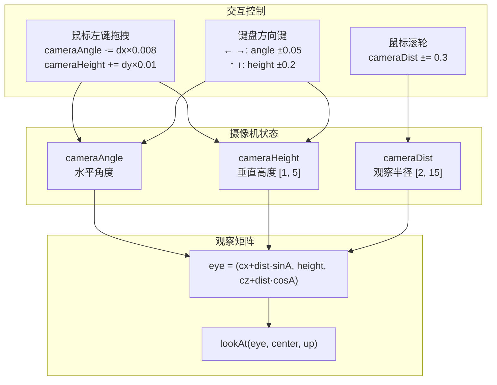

**方案 8**：球坐标系轨道摄像机，参数为 `cameraAngle`（水平角）、`cameraHeight`（垂直高度）、`cameraDist`（半径）。左键拖拽改变水平和垂直角度，滚轮改变半径，方向键精细控制。

**计算公式 8**：

$$
\begin{aligned}
\text{球坐标 $\to$ 笛卡尔:} \\
\mathbf{eye}.x &= x_c + d \cdot \sin\alpha \\
\mathbf{eye}.y &= h \\
\mathbf{eye}.z &= z_c + d \cdot \cos\alpha
\end{aligned}
$$

鼠标拖拽水平旋转及垂直升降:

$$
\begin{aligned}
\alpha &\mathrel{-}= \Delta x \times 0.008 \\
h &\mathrel{+}= \Delta y \times 0.01,\quad h = \text{clamp}(h,\ 1.0,\ 5.0)
\end{aligned}
$$

滚轮缩放:

$$
d = \text{clamp}(d \pm 0.3,\ 2.0,\ 15.0)
$$

**伪代码 8**：

```
// == 鼠标回调 ==
mouseCallback(button, state, x, y):
    if 左键按下:
        mouseDragging = true
        mouseLastX, mouseLastY = x, y
    if 左键释放:
        mouseDragging = false
    if 滚轮上(button==3):
        cameraDist = min(cameraDist + 0.3, 15)
    if 滚轮下(button==4):
        cameraDist = max(cameraDist - 0.3, 2)


// == 鼠标移动回调 ==
mouseMotionCallback(x, y):
    if mouseDragging:
        dx = x - mouseLastX
        dy = y - mouseLastY
        cameraAngle -= dx × 0.008       // 水平旋转
        cameraHeight += dy × 0.01       // 垂直升降
        cameraHeight = clamp(1.0, 5.0)
        mouseLastX, mouseLastY = x, y


// == 键盘方向键 ==
specialCallback(key):
    GLUT_KEY_LEFT:   cameraAngle -= 0.05
    GLUT_KEY_RIGHT:  cameraAngle += 0.05
    GLUT_KEY_UP:     cameraHeight += 0.2, clamp(1.0, 5.0)
    GLUT_KEY_DOWN:   cameraHeight -= 0.2, clamp(1.0, 5.0)


// == 渲染中构建观察矩阵 ==
renderScene():
    // 球坐标 → 相机位置
    eye = (charPosX + dist·sin(angle), height, charPosZ + dist·cos(angle))
    center = (charPosX, 0, charPosZ)
    up = (0, 1, 0)
    
    view = lookAt(eye, center, up)
    proj = perspective(45°, aspect, 0.1, 30)
```

---

## 难点 ⑨：Mat4 矩阵库手写实现

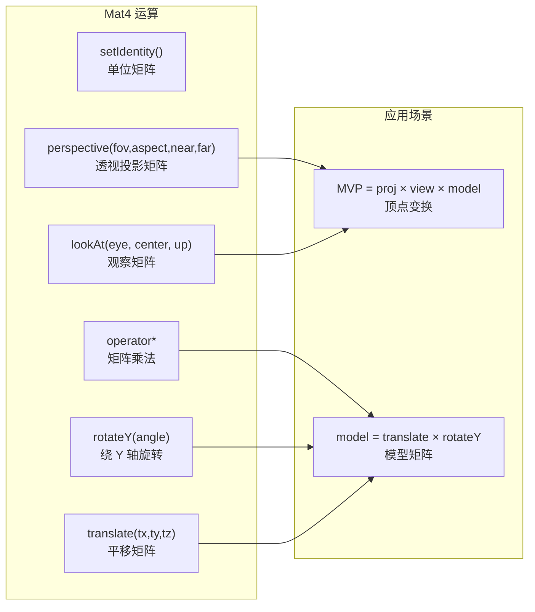

**问题 9**：项目不使用任何第三方数学库，需要手写实现 4×4 矩阵运算（透视投影、观察矩阵、旋转、平移、矩阵乘法），所有计算在 CPU 端完成。

**方案 9**：用 `float m[16]` 表示列主序矩阵，实现 `perspective()`、`lookAt()`、`translate()`、`rotateY()` 静态工厂方法和矩阵乘法。

**计算公式 9**：

透视投影（$\text{fov}$、$aspect$、$near$、$far$）:

$$
\begin{aligned}
f &= \frac{1}{\tan(\text{fov}/2)},\quad nf = \frac{1}{near - far} \\[6pt]
\mathbf{P} &= \begin{pmatrix}
\frac{f}{aspect} & 0 & 0 & 0 \\
0 & f & 0 & 0 \\
0 & 0 & (far+near) \cdot nf & 2 \cdot far \cdot near \cdot nf \\
0 & 0 & -1 & 0
\end{pmatrix}
\end{aligned}
$$

观察矩阵 $\text{lookAt}(\mathbf{eye},\ \mathbf{center},\ \mathbf{up})$:

$$
\begin{aligned}
\mathbf{f} &= \text{normalize}(\mathbf{center} - \mathbf{eye}) \\
\mathbf{s} &= \text{normalize}(\mathbf{f} \times \mathbf{up}) \\
\mathbf{u} &= \mathbf{s} \times \mathbf{f} \\[6pt]
\mathbf{V} &= \begin{pmatrix}
s_x & s_y & s_z & -\mathbf{s} \cdot \mathbf{eye} \\
u_x & u_y & u_z & -\mathbf{u} \cdot \mathbf{eye} \\
-f_x & -f_y & -f_z & \mathbf{f} \cdot \mathbf{eye} \\
0 & 0 & 0 & 1
\end{pmatrix}
\end{aligned}
$$

绕 Y 轴旋转 $\text{rotateY}(\theta)$:

$$
\mathbf{R}_y(\theta) = \begin{pmatrix}
\cos\theta & 0 & \sin\theta & 0 \\
0 & 1 & 0 & 0 \\
-\sin\theta & 0 & \cos\theta & 0 \\
0 & 0 & 0 & 1
\end{pmatrix}
$$

平移 $\text{translate}(t_x, t_y, t_z)$:

$$
\mathbf{T} = \begin{pmatrix}
1 & 0 & 0 & t_x \\
0 & 1 & 0 & t_y \\
0 & 0 & 1 & t_z \\
0 & 0 & 0 & 1
\end{pmatrix}
$$

矩阵乘法 $\mathbf{C} = \mathbf{A} \times \mathbf{B}$（列主序）:

$$
C_{ji} = \sum_{k=0}^{3} A_{ki} \cdot B_{jk},\quad i,j \in \{0,1,2,3\}
$$

**伪代码 9**：

```
struct Mat4:
    m[16]  // 列主序

    setIdentity():
        m = [1,0,0,0, 0,1,0,0, 0,0,1,0, 0,0,0,1]

    static perspective(fovY, aspect, nearZ, farZ):
        f = 1 / tan(fovY × 0.5 × π/180)
        nf = 1 / (nearZ - farZ)
        m[0] = f/aspect
        m[5] = f
        m[10] = (farZ+nearZ) × nf
        m[11] = -1
        m[14] = 2 × farZ × nearZ × nf
        return mat

    static lookAt(eye, center, up):
        f = normalize(center - eye)
        s = normalize(cross(f, up))
        u = cross(s, f)
        
        m[0..3] = (s.x, u.x, -f.x, 0)
        m[4..7] = (s.y, u.y, -f.y, 0)
        m[8..11] = (s.z, u.z, -f.z, 0)
        m[12] = -dot(s, eye)
        m[13] = -dot(u, eye)
        m[14] = dot(f, eye)
        m[15] = 1
        return mat

    static translate(tx, ty, tz):
        m[12] = tx, m[13] = ty, m[14] = tz
        return mat

    static rotateY(angle):
        c = cos(angle), s = sin(angle)
        m[0] = c, m[2] = s
        m[8] = -s, m[10] = c
        return mat

    operator×(other):
        for j = 0..3:
            for i = 0..3:
                sum = 0
                for k = 0..3:
                    sum += m[k×4+i] × other.m[j×4+k]
                result.m[j×4+i] = sum
        return result
```

---

## 难点 ⑩：网格参数化生成器

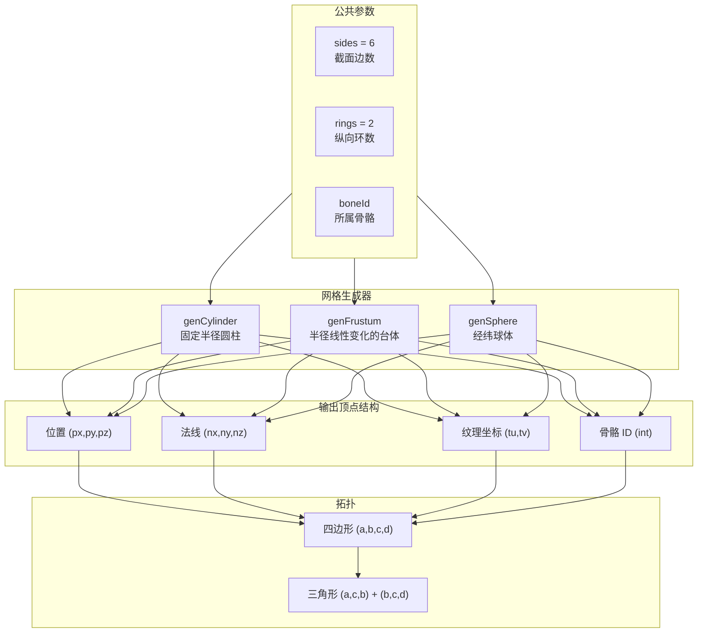

**方案 10**：三个生成器 `genCylinder` / `genFrustum` / `genSphere` 均按环-分段结构生成顶点和三角形条带索引。

**计算公式 10**：

圆柱体（环 $j$，段 $i$）:

$$
\begin{aligned}
v &= \frac{j}{rings},\quad y = cy - \frac{height}{2} + v \cdot height \\
u &= \frac{i}{sides},\quad \theta = u \cdot 2\pi \\
\mathbf{pos} &= (cx + r\cos\theta,\ y,\ cz + r\sin\theta) \\
\mathbf{normal} &= (\cos\theta,\ 0,\ \sin\theta)
\end{aligned}
$$

台体（圆台）— 半径线性变化:

$$
r = topR \cdot (1 - v) + botR \cdot v
$$

球体（经纬）:

$$
\begin{aligned}
\phi &= v \cdot \pi,\quad y = cy + radius \cdot \cos\phi \\
r &= radius \cdot \sin\phi \\
\varphi &= u \cdot 2\pi \\
\mathbf{pos} &= (cx + r\cos\varphi,\ y,\ cz + r\sin\varphi) \\
\mathbf{normal} &= \text{normalize}(\mathbf{pos} - \mathbf{center})
\end{aligned}
$$

三角形条带索引（四边形 $(a,b,c,d)$ $\to$ 两三角形）:

$$
\triangle(a,c,b),\quad \triangle(b,c,d)
$$

**伪代码 10**：

```
genCylinder(cx, cy, cz, radius, height, sides, rings, boneId, verts, idx):
    halfH = height / 2
    base = verts.size()
    
    for j = 0 to rings:           // 环
        v = j / rings
        y = cy - halfH + v × height
        for i = 0 to sides:       // 分段
            u = i / sides
            θ = u × 2π
            x = cx + radius × cos(θ)
            z = cz + radius × sin(θ)
            
            顶点 = {位置(x,y,z), 法线(cosθ,0,sinθ), UV(u,v), boneId}
            添加到 verts
    
    // 三角形条带
    for j = 0 to rings-1:
        for i = 0 to sides-1:
            a = base + j×(sides+1) + i
            b = a + 1
            c = base + (j+1)×(sides+1) + i
            d = c + 1
            idx += [a, c, b, b, c, d]


genFrustum(cx, cy, cz, topR, botR, height, sides, rings, boneId, verts, idx):
    // 与圆柱体相同，但半径线性变化
    r = topR × (1 - v) + botR × v
    // 其余同 genCylinder


genSphere(cx, cy, cz, radius, lats, lons, boneId, verts, idx):
    for j = 0 to lats:            // 纬度
        v = j / lats
        θ = v × π
        y = cy + radius × cos(θ)
        r = radius × sin(θ)
        for i = 0 to lons:        // 经度
            u = i / lons
            φ = u × 2π
            x = cx + r × cos(φ)
            z = cz + r × sin(φ)
            
            n = normalize(x-cx, y-cy, z-cz)  // 精确法线
            
            顶点 = {位置(x,y,z), 法线n, UV(u,v), boneId}
            添加到 verts
    
    // 三角形条带（同 genCylinder）
```

---

## 难点 ⑪：OpenGL 渲染管线初始化与资源管理

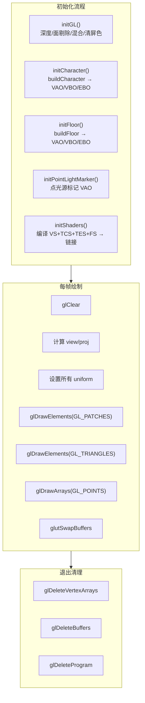

**方案 11**：按模块化设计拆分初始化步骤，使用全局状态 `GlobalState` 管理所有 GL 资源和参数。

**伪代码 11**：

```
// == 全局状态 ==
struct GlobalState:
    // GL 资源
    charVAO, charVBO, charEBO           // 人物网格
    floorVAO, floorVBO, floorEBO        // 地面网格
    pointVAO, pointVBO                  // 光源标记
    charProgram, floorProgram           // 着色器程序
    
    // Uniform 位置
    uTime_loc, uJumpPhase_loc, ...      // 所有 uniform 句柄
    
    // 动画状态
    time, jumpPhase, moveSpeed
    moveDirX, moveDirZ
    keys[256], waving, wavePhase
    
    // 渲染参数
    tessLevel, cameraAngle, cameraDist, cameraHeight
    modelRotY, charPosX, charPosZ


// == 初始化 ==
initGL():
    glClearColor(0.08, 0.10, 0.15, 1)  // 深蓝黑背景
    glEnable(DEPTH_TEST)
    glDepthFunc(LEQUAL)
    glEnable(CULL_FACE)
    glCullFace(BACK)
    glFrontFace(CCW)
    glEnable(BLEND)
    glBlendFunc(SRC_ALPHA, ONE_MINUS_SRC_ALPHA)


initCharacter():
    mesh = buildCharacter()            // CPU 端生成网格
    g.charMesh = mesh
    
    // 创建 VAO/VBO/EBO
    glGenVertexArrays(1, &charVAO)
    glGenBuffers(1, &charVBO)
    glGenBuffers(1, &charEBO)
    
    // 上传数据
    glBindBuffer(ARRAY_BUFFER, charVBO)
    glBufferData(ARRAY_BUFFER, vertices, STATIC_DRAW)
    glBindBuffer(ELEMENT_ARRAY_BUFFER, charEBO)
    glBufferData(ARRAY_BUFFER, indices, STATIC_DRAW)
    
    // 配置顶点属性
    glVertexAttribPointer(0, 3, FLOAT, sizeof(Vertex), offsetof(px))  // 位置
    glVertexAttribPointer(1, 3, FLOAT, sizeof(Vertex), offsetof(nx))  // 法线
    glVertexAttribPointer(2, 2, FLOAT, sizeof(Vertex), offsetof(tu))  // UV
    glVertexAttribIPointer(3, 1, INT,  sizeof(Vertex), offsetof(boneId)) // 骨骼ID (整型)


initShaders():
    // 编译各阶段
    vs  = compileShader(VERTEX_SHADER, VS_SOURCE)
    tcs = compileShader(TESS_CONTROL_SHADER, TCS_SOURCE)
    tes = compileShader(TESS_EVALUATION_SHADER, TES_SOURCE)
    fs  = compileShader(FRAGMENT_SHADER, FS_SOURCE)
    
    // 链接
    charProgram = linkProgram(vs, tcs, tes, fs)
    
    // 获取 uniform 位置
    uTime_loc = glGetUniformLocation(charProgram, "uTime")
    // ... 所有 uniform


// == 每帧绘制 ==
renderScene():
    glClear(COLOR_BUFFER | DEPTH_BUFFER)
    
    // 计算 view/proj
    view = lookAt(eye, center, up)
    proj = perspective(45°, aspect, 0.1, 30)
    
    // 人物 model = translate(charPos) × rotateY(modelRotY)
    model = translate(charPosX, 0, charPosZ) × rotateY(modelRotY)
    mvp = proj × view × model
    
    // 设置 uniform 并绘制
    glUseProgram(charProgram)
    设置所有 uniform
    glDrawElements(GL_PATCHES, indexCount, UNSIGNED_INT, 0)
    
    // 绘制地面
    glUseProgram(floorProgram)
    glDrawElements(GL_TRIANGLES, floorIndexCount, UNSIGNED_INT, 0)
    
    // 绘制光源标记点
    glUseProgram(floorProgram)
    glDrawArrays(GL_POINTS, 0, 1)
    
    glutSwapBuffers()


// == 清理 ==
main(退出时):
    glDeleteVertexArrays / glDeleteBuffers
    glDeleteProgram
```

---

## 难点 ⑫：挥手正交轴旋转

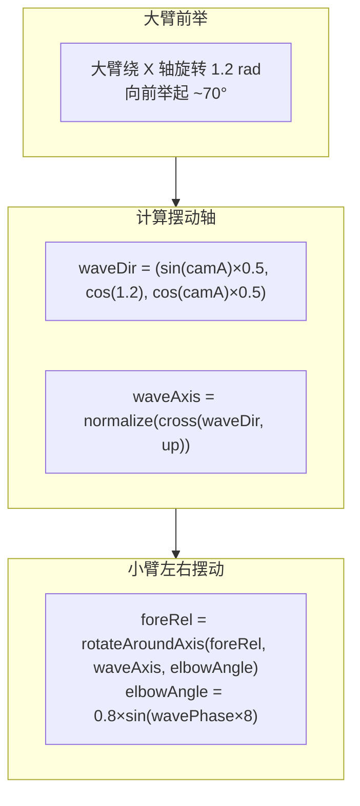

**方案 12**：挥手时右臂大臂使用固定前举角度（绕 X 轴旋转 1.2 弧度 ≈ 70°），小臂使用正交轴旋转：根据相机角度计算挥手方向轴，绕此轴做左右摆动。

**计算公式 12**：

大臂前举（固定角度 ≈ $70^\circ$）:

$$
\theta_{shoulder}^{wave} = 1.2
$$

小臂摆动轴（基于相机方向）:

$$
\begin{aligned}
\mathbf{d}_{wave} &= (\sin\alpha \times 0.5,\ \cos(1.2),\ \cos\alpha \times 0.5) \\
\mathbf{a}_{wave} &= \text{normalize}(\mathbf{d}_{wave} \times \mathbf{up}),\quad \mathbf{up} = (0, 1, 0)
\end{aligned}
$$

小臂旋转:

$$
\begin{aligned}
\mathbf{foreRel} &= \text{rotateAroundAxis}(\mathbf{foreRel},\ \mathbf{a}_{wave},\ \theta_{elbow}) \\
\theta_{elbow} &= 0.8 \times \sin(wavePhase \times 8)
\end{aligned}
$$

**伪代码 12**：

```
// 顶点着色器中右臂处理
if 右臂 AND waving:
    // 大臂前举（绕 X 轴）
    finalShoulderAngle = 1.2
    finalElbowAngle = 0.8 × sin(uWavePhase × 8)  // 快速摆动
    
    // 上臂先做肩关节旋转
    shoulder = jointPos(4)  // 右肩
    relU = pos - shoulder
    posU = shoulder + rotateX(relU, finalShoulderAngle)
    
    // 前臂：两阶段 + 正交轴
    relF = pos - shoulder
    relF = rotateX(relF, finalShoulderAngle)
    rotatedElbow = rotateX(jointPos(5) - shoulder, finalShoulderAngle)
    foreRel = relF - rotatedElbow
    
    // 计算摆动轴
    waveDir = (sin(uCameraAngle)×0.5, cos(1.2), cos(uCameraAngle)×0.5)
    waveAxis = normalize(cross(waveDir, (0,1,0)))
    
    // 正交轴旋转实现左右摆动
    foreRel = rotateAroundAxis(foreRel, waveAxis, finalElbowAngle)
    norm = rotateAroundAxis(rotatedNormal, waveAxis, finalElbowAngle)
    
    posF = shoulder + rotatedElbow + foreRel
    
    // smoothstep 混合上下臂
    blend = smoothstep(...)
    pos = mix(posF, posU, blend)
```

---

## 难点 ⑬：点光源轨道运动与衰减

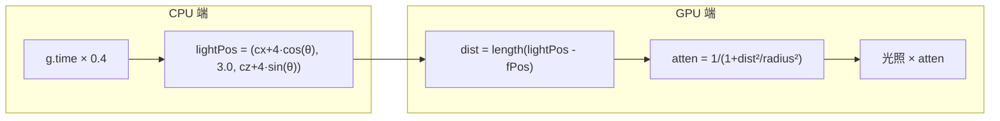

**问题 13**：点光源需围绕人物做轨道运动，并提供基于距离的平滑衰减光照，避免光线突变。

**方案 13**：光源位置由 `getLightPos()` 基于时间计算圆周运动，在片段着色器中使用改进的距离衰减公式。

**计算公式 13**：

光源轨道位置:

$$
\begin{aligned}
\theta &= uTime \times 0.4 \\
\mathbf{lightPos} &= (x_c + 4\cos\theta,\ 3.0,\ z_c + 4\sin\theta)
\end{aligned}
$$

距离平方衰减模型:

$$
\text{atten} = \frac{1}{1 + \|\mathbf{L}_{orig}\|^2 / r^2}
\quad\Rightarrow\quad
\begin{cases}
dist = 0: & \text{atten} = 1 \quad \text{(最亮)} \\
dist = r: & \text{atten} = 0.5 \quad \text{(半亮度)} \\
dist \to \infty: & \text{atten} \to 0
\end{cases}
$$

**伪代码 13**：

```
// CPU 端计算
getLightPos():
    angle = g.time × 0.4
    return (charPosX + 4×cos(angle), 3.0, charPosZ + 4×sin(angle))


// 片段着色器
FS_main():
    L_orig = uLightPos - fPos
    dist = length(L_orig)
    L = normalize(L_orig)
    
    atten = 1 / (1 + dist×dist / (uLightRadius×uLightRadius))
    atten = clamp(atten, 0, 1)
    
    // 衰减后的光照
    diffuse = gooch × 0.6 × atten
    spec = specular × atten
    rim = rimLight × atten
```

---

## 难点 ⑭：人物构建与骨骼装配

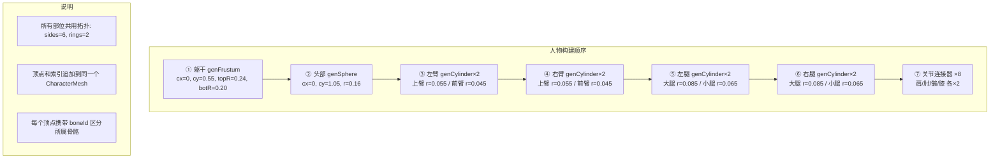

**方案 14**：在 `buildCharacter()` 中按顺序生成各部位网格（躯干→头→左臂→右臂→左腿→右腿→关节连接器），所有顶点和索引追加到同一 `CharacterMesh` 中。关节连接器定义使用硬编码常量表，精确匹配骨骼末端坐标。

**伪代码 14**：

```
buildCharacter():
    mesh = {空顶点列表, 空索引列表}
    sides = 6, rings = 2
    
    // 躯干（台体：上粗下细）
    genFrustum(cx=0,   cy=0.55, cz=0, topR=0.24, botR=0.20, h=0.80, BONE_TORSO)
    
    // 头部（球体）
    genSphere(  cx=0,   cy=1.05, cz=0, radius=0.16, lats=4, sides=6, BONE_HEAD)
    
    // 左臂
    genCylinder(cx=-0.26, cy=0.71, cz=0, r=0.055, h=0.38, BONE_L_UPPER_ARM)
    genCylinder(cx=-0.28, cy=0.29, cz=0, r=0.045, h=0.38, BONE_L_FOREARM)
    
    // 右臂
    genCylinder(cx= 0.26, cy=0.71, cz=0, r=0.055, h=0.38, BONE_R_UPPER_ARM)
    genCylinder(cx= 0.28, cy=0.29, cz=0, r=0.045, h=0.38, BONE_R_FOREARM)
    
    // 左腿
    genCylinder(cx=-0.10, cy=-0.125, cz=0, r=0.085, h=0.45, BONE_L_UPPER_LEG)
    genCylinder(cx=-0.11, cy=-0.625, cz=0, r=0.065, h=0.45, BONE_L_LOWER_LEG)
    
    // 右腿
    genCylinder(cx= 0.10, cy=-0.125, cz=0, r=0.085, h=0.45, BONE_R_UPPER_LEG)
    genCylinder(cx= 0.11, cy=-0.625, cz=0, r=0.065, h=0.45, BONE_R_LOWER_LEG)
    
    // 关节连接器（6 个）
    for 每个连接器定义:
        genJointConnector(def, sides, rings, mesh.vertices, mesh.indices)
    
    return mesh


// 关节连接器定义表
CONNECTORS = [
    // 左肩: 躯干表面(-0.20,0.90) → 关节(-0.26,0.90), r=0.055
    // 右肩: 躯干表面( 0.20,0.90) → 关节( 0.26,0.90), r=0.055
    // 左肘: 上臂底(-0.26,0.52) → 关节(-0.28,0.48), r=0.055→0.045
    // 右肘: 上臂底( 0.26,0.52) → 关节( 0.28,0.48), r=0.055→0.045
    // 左髋: 躯干底(-0.10,0.15) → 关节(-0.10,0.10), r=0.085→0.12
    // 右髋: 躯干底( 0.10,0.15) → 关节( 0.10,0.10), r=0.085→0.12
    // 左膝: 大腿底(-0.10,-0.35) → 关节(-0.11,-0.40), r=0.085→0.065
    // 右膝: 大腿底( 0.10,-0.35) → 关节( 0.11,-0.40), r=0.085→0.065
]
```

---

## 总体流程图

### 启动阶段

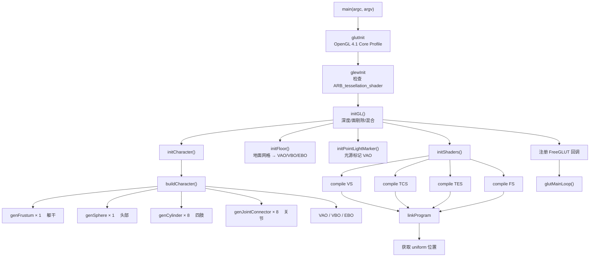

### 每帧更新（updateAnimation）

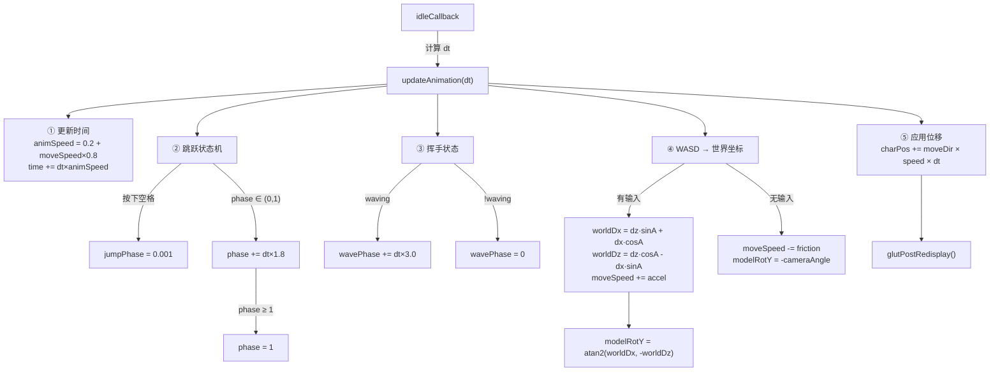

### 每帧绘制（renderScene）

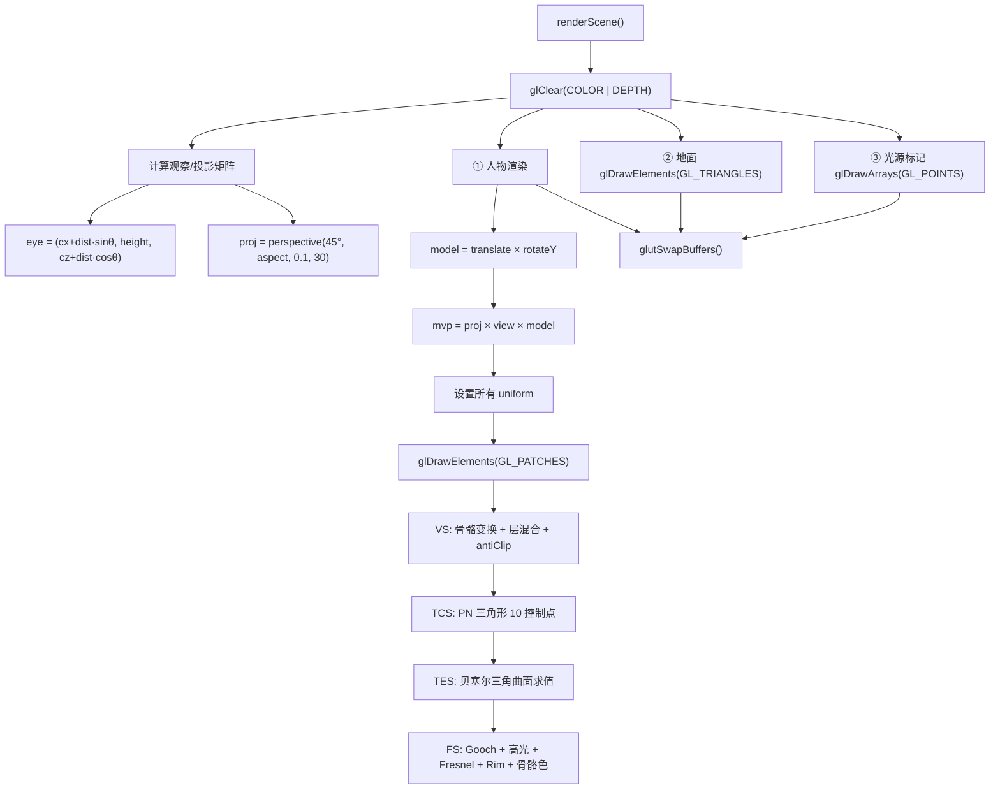

### CPU → GPU 完整数据流

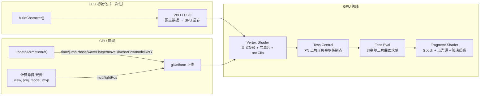